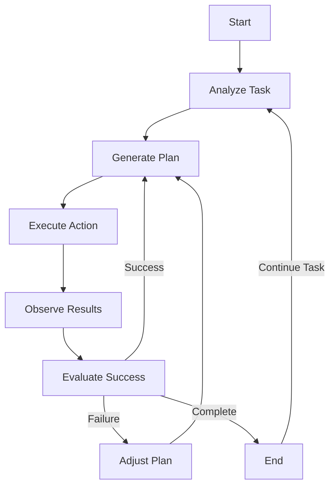
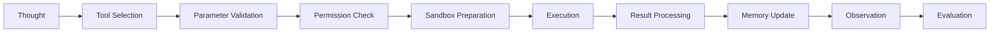

# 🤖 ReAct Engine Architecture

## Overview

The glayph/agent framework implements a robust **Reasoning & Action (ReAct) Engine** that enables autonomous AI agents to interact with the real world through a structured Thought-Action-Observation loop. This architecture combines cognitive reasoning with tool execution to create intelligent, goal-oriented agents.

---

## 🔄 Core ReAct Loop

### Thought Phase
The agent analyzes the task, plans the approach, and generates thoughts:

```typescript
interface Thought {
  id: string;
  type: 'analysis' | 'planning' | 'decision' | 'validation';
  content: string;
  confidence: number;
  dependencies: string[];
  reasoning: string;
  timestamp: number;
}
```

### Action Phase
The agent selects and executes tools based on its thoughts:

```typescript
interface Action {
  id: string;
  type: 'tool_call' | 'function' | 'subagent';
  target: string;
  parameters: any;
  context: ExecutionContext;
  timeout: number;
  retries: number;
  timestamp: number;
}
```

### Observation Phase
The agent processes results and updates its internal state:

```typescript
interface Observation {
  id: string;
  actionId: string;
  result: any;
  status: 'success' | 'error' | 'partial';
  metadata: ObservationMetadata;
  timestamp: number;
}
```

---

## 🏗️ Architecture Components

### 1. State Machine

The ReAct engine operates as a finite state machine:



#### States
- **IDLE**: Waiting for task assignment
- **ANALYZING**: Understanding task requirements
- **PLANNING**: Creating execution strategy
- **EXECUTING**: Running tools and functions
- **OBSERVING**: Processing results
- **EVALUATING**: Assessing outcome
- **ADJUSTING**: Refining approach

### 2. Memory Management

#### Working Memory
- **Short-term**: Active task context and plan
- **Context window**: Token budget and conversation history
- **Tool state**: Tool usage and availability

#### Long-term Memory
- **Temporal knowledge graph**: Event sequences and relationships
- **Semantic memory**: Concepts and facts
- **Procedural memory**: Learned behaviors and patterns

### 3. Tool Execution Engine

#### Tool Registry
```typescript
interface ToolRegistry {
  tools: Map<string, Tool>;
  categories: Map<string, ToolCategory>;
  permissions: PermissionMatrix;
  sandbox: SandboxManager;
}
```

#### Tool Calling Protocol
```typescript
interface ToolCall {
  tool: string;
  parameters: any;
  context: ExecutionContext;
  options: ToolOptions;
}

interface ToolOptions {
  timeout: number;
  retries: number;
  sandbox: boolean;
  audit: boolean;
}
```

---

## 🧠 Reasoning Module

### Cognitive Architecture

The reasoning module implements multiple cognitive strategies:

#### 1. Analytical Reasoning
- **Pattern Recognition**: Identify similar past tasks
- **Goal Decomposition**: Break down complex goals
- **Resource Planning**: Estimate required tools and resources

#### 2. Planning Algorithm
```typescript
class PlanningAlgorithm {
  // Hierarchical task decomposition
  async decomposeTask(task: Task): Promise<TaskNode[]>;
  
  // Resource allocation
  async allocateResources(nodes: TaskNode[]): Promise<ResourceAllocation[]>;
  
  // Risk assessment
  async assessRisks(node: TaskNode): Promise<RiskAssessment[]>;
  
  // Optimization
  async optimizePlan(plan: ExecutionPlan): Promise<OptimizedPlan>;
}
```

#### 3. Decision Making
- **Utility Theory**: Maximize expected utility
- **Uncertainty Handling**: Confidence scoring and probabilistic reasoning
- **Multi-criteria Analysis**: Balance between multiple objectives

---

## ⚡ Execution Cycle

### Detailed Flow

```typescript
class ReActEngine {
  async execute(task: Task): Promise<ExecutionResult> {
    // Phase 1: Analysis
    const thought = await this.generateThought(task);
    
    // Phase 2: Planning
    const plan = await this.createPlan(thought);
    
    // Phase 3: Execution
    const result = await this.executePlan(plan);
    
    // Phase 4: Observation
    const observation = await this.processResults(result);
    
    // Phase 5: Evaluation
    const evaluation = await this.evaluateSuccess(observation);
    
    // Phase 6: Adaptation
    if (!evaluation.success) {
      await this.adaptPlan(evaluation);
      return this.execute(task); // Recursive retry
    }
    
    return { success: true, result, plan };
  }
}
```

### Error Recovery

The engine implements robust error recovery:

#### 1. Circuit Breaker Pattern
- **Failure Threshold**: Maximum allowed failures
- **Recovery Timeout**: Time to attempt recovery
- **Fallback Behavior**: Graceful degradation

#### 2. Retry Strategies
- **Exponential Backoff**: Increasing delays between retries
- **Adaptive Timeout**: Dynamic timeout adjustment
- **Context-aware Retries**: Different strategies based on error type

---

## 🧪 Tool Integration

### Tool Calling Pipeline



#### Tool Categories

| Category | Tools | Examples |
|----------|-------|----------|
| **Shell** | Command execution | `shell_execute`, `file_operations` |
| **Browser** | Web automation | `browser_navigate`, `scrape_page` |
| **Desktop** | Windows automation | `computer_observe`, `ui_automation` |
| **Data** | Data processing | `web_search`, `scrape_json` |
| **System** | System operations | `system_info`, `process_management` |

---

## 📊 Performance Optimization

### Resource Management

#### 1. Token Budgeting
```typescript
interface TokenBudget {
  total: number;
  used: number;
  remaining: number;
  reset: number;
  warnings: WarningThreshold[];
}
```

#### 2. Context Window Management
- **Sliding Window**: Dynamic context management
- **Relevance Scoring**: Prioritize important context
- **Compression**: Summarize long conversations

#### 3. Parallel Execution
```typescript
interface ParallelExecution {
  maxConcurrent: number;
  batchSize: number;
  dependencies: Map<string, string[]>;
  priority: Map<string, number>;
}
```

### Caching Strategies

#### 1. Tool Result Caching
- **Short-term**: Recent tool results (Redis)
- **Long-term**: Historical tool usage patterns
- **Contextual**: User-specific preferences

#### 2. Memory Caching
- **Working Memory**: Active task context
- **Semantic Cache**: Common responses
- **Vector Cache**: Embedding-based similarity

---

## 🔒 Security & Safety

### Sandbox Implementation

#### 1. Process Isolation
```typescript
interface SandboxConfig {
  isolation: 'container' | 'vm' | 'process';
  capabilities: string[];
  restrictions: string[];
  resourceLimits: ResourceLimits;
}
```

#### 2. Input Validation
- **Schema Validation**: JSON schema compliance
- **Content Sanitization**: Remove malicious content
- **Policy Enforcement**: Business rule compliance

### Audit & Monitoring

#### 1. Activity Logging
```typescript
interface AuditLog {
  timestamp: number;
  agentId: string;
  sessionId: string;
  tool: string;
  action: string;
  input: any;
  output: any;
  duration: number;
  success: boolean;
  metadata: AuditMetadata;
}
```

#### 2. Anomaly Detection
- **Pattern Analysis**: Detect unusual behavior
- **Threshold Monitoring**: Alert on abnormal usage
- **Behavior Profiling**: Learn normal patterns

---

## 📈 Monitoring & Observability

### Metrics Collection

#### 1. Performance Metrics
```typescript
interface PerformanceMetrics {
  executionTime: number;
  toolCalls: number;
  tokensUsed: number;
  successRate: number;
  errorRate: number;
  resourceUtilization: ResourceUsage;
}
```

#### 2. Quality Metrics
- **Task Completion Rate**: Percentage of tasks completed successfully
- **Time-to-Completion**: Average execution time
- **Cost Efficiency**: Resource usage per task
- **User Satisfaction**: Feedback and ratings

### Visualization

#### Dashboard Components
- **Execution Timeline**: Real-time activity visualization
- **Tool Usage Statistics**: Breakdown by category and frequency
- **Performance Trends**: Historical performance analysis
- **Resource Consumption**: Memory, CPU, and network usage

---

## 🔄 Evolution & Adaptation

### Self-Improvement

#### 1. Learning Loop
```typescript
class SelfImprovementEngine {
  // Performance analysis
  async analyzePerformance(metrics: PerformanceMetrics): Promise<ImprovementPlan>;
  
  // Strategy optimization
  async optimizeStrategies(plan: ImprovementPlan): Promise<OptimizationResult>;
  
  // Adaptation
  async adapt(strategy: Strategy): Promise<AdaptedStrategy>;
}
```

#### 2. Continuous Improvement
- **Algorithm Optimization**: Refine reasoning strategies
- **Tool Enhancement**: Improve tool implementations
- **Configuration Tuning**: Adjust resource allocation
- **Knowledge Updates**: Incorporate new information

---

## 🛠️ Development & Testing

### Unit Testing

```typescript
// react-engine.test.ts
import { ReActEngine } from '../src/react-engine';

describe('ReActEngine', () => {
  let engine: ReActEngine;
  
  beforeEach(() => {
    engine = new ReActEngine(config);
  });
  
  it('should execute simple task', async () => {
    const task = new Task('Read file', { path: 'test.txt' });
    const result = await engine.execute(task);
    
    expect(result.success).toBe(true);
    expect(result.result.content).toBe('Hello World');
  });
  
  it('should handle tool errors', async () => {
    const task = new Task('Execute invalid command', { command: 'invalid' });
    await expect(engine.execute(task)).rejects.toThrow('Tool execution failed');
  });
});
```

### Integration Testing

#### 1. End-to-End Scenarios
- **Complete Workflow**: Full task execution from start to finish
- **Tool Chains**: Sequential tool execution
- **Error Recovery**: Robust error handling

#### 2. Performance Testing
```bash
# Performance benchmarks
npm run test:performance
npm run test:load
npm run test:stress
```

---

## 📖 References

### Related Components

- **Memory Bridge**: `packages/core/src/memory/` - Context sharing
- **Tool Registry**: `packages/core/src/tools/` - Tool management
- **Safety Module**: `packages/core/src/safety/` - Security enforcement

### API Documentation

- [ReAct Engine API](/api/react-engine.md)
- [Tool Registry API](/api/tools.md)
- [Memory Integration API](/api/memory.md)

---

## 🚀 Getting Started

### Basic Usage

```typescript
import { ReActEngine, Task } from '@glayph/agent';

const engine = new ReActEngine({
  model: 'google/gemini-2.0-flash-001',
  tools: ['browser_navigate', 'file_read', 'web_search'],
  memory: { enabled: true },
  safety: { sandbox: true }
});

async function runAgent() {
  const task = new Task('Read README and summarize key features');
  const result = await engine.execute(task);
  console.log(result.result.summary);
}

runAgent();
```

### Configuration

```typescript
const config: ReActEngineConfig = {
  reasoning: {
    strategy: 'hierarchical',
    confidenceThreshold: 0.8,
    maxPlanningSteps: 10
  },
  execution: {
    parallel: true,
    maxConcurrentTools: 5,
    timeout: 30000
  },
  memory: {
    enabled: true,
    persistence: true,
    type: 'sqlite-vector'
  },
  safety: {
    sandbox: true,
    validation: 'strict',
    audit: true
  }
};
```

---

The ReAct engine is the core cognitive architecture of glayph/agent, combining intelligent reasoning with tool execution to create powerful, autonomous AI agents capable of complex task completion in dynamic environments.
